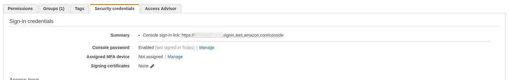
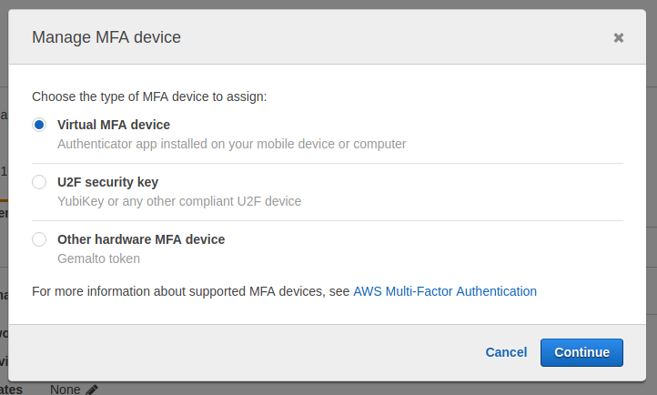
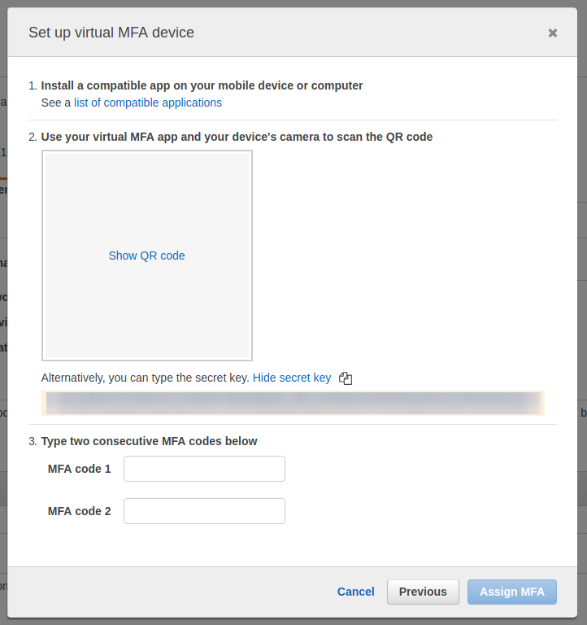
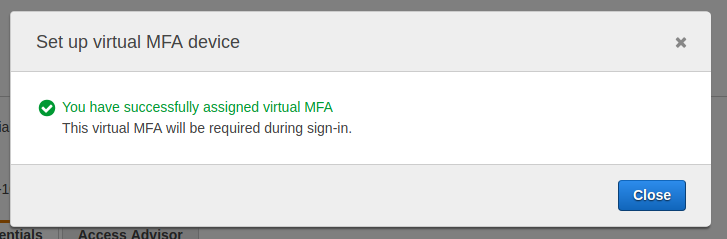

keyfob is a two-factor authentication agent suitable for AWS and Github. Works pretty much the same as Google Authenticator or Authy, but uses your laptop's keychain.

## Installation

If you use homebrew:

```
brew tap StevenACoffman/keyfob
brew install keyfob
```
Any subsequent releases should get picked up automatically with `brew upgrade`

If don't use homewbrew, and you're on a mac, you can just do this:

    wget -O - https://raw.githubusercontent.com/StevenACoffman/keyfob/master/install.sh | bash


This will download the github 0.3.0 binary release for mac, and move any of your MFA secrets from `2fa` over to your keychain.

## Usage

    keyfob add [name] [key]
    keyfob otp [name]
    keyfob list
    keyfob vault [name] [profile]
    keyfob help

+ `keyfob add name` adds a new key to the keyfob keychain with the given name. It
prints a prompt to standard error and reads a two-factor key from standard
input. Two-factor keys are short case-insensitive strings of letters A-Z and
digits 2-7.

  The new key generates time-based (TOTP) authentication codes.

+ `keyfob opt [name]` prints a One Time Password (aka two-factor authentication) code from the key with the
given name. If `--clip` is specified, `keyfob` also copies to the code to the system
clipboard.

+ `keyfob list` prints the names of all the added keys, if any.

+ `keyfob vault [name] [profile]` acts as a will act as an [AWS credential helper](https://docs.aws.amazon.com/cli/latest/topic/config-vars.html#sourcing-credentials-from-external-processes) using [AWS Vault](https://github.com/99designs/aws-vault/) and a One Time Password.

The Time-based One Time Password (TOTP) authentication codes are derived from a hash of the
key and the current time, so it is important that the system clock have at
least one-minute accuracy.

The keychain is stored unencrypted in the text file `$HOME/.keyfob`.

## Example

During GitHub 2FA setup, at the “Scan this barcode with your app” step,
click the “enter this text code instead” link. A window pops up showing
“your two-factor secret,” a short string of letters and digits.

Add it to keyfob under the name github, typing the secret at the prompt:

    $ keyfob add github
    keyfob key for github: nzxxiidbebvwk6jb

Then whenever GitHub prompts for a 2FA code, run keyfob to obtain one:

    $ keyfob otp github
    268346

## Derivation (Credit where Credit is due)

This is just a little toy cobbled together from [2fa](https://github.com/rsc/2fa/), [cobra](https://github.com/spf13/cobra), and [go-keyring](https://github.com/zalando/go-keyring) and using [goreleaser](https://github.com/goreleaser/goreleaser).
The directions I had below this were confusing, so I stole some of the directions from [this article on how to do a similar thing with a yubikey](https://hackernoon.com/use-a-yubikey-as-a-mfa-device-to-replace-google-authenticator-b4f4c0215f2).

## Really, does this make sense?

At least to me, it does. My laptop features encrypted storage, a stronger authentication mechanism, and I take good care of its physical integrity.

My phone also runs arbitrary apps, is constantly connected to the Internet, gets forgotten on tables.

Thanks to the convenience of a command line utility, I'm more likely to enable MFA in more places.

Clearly a win for security.

## Dependencies

#### OS X

The OS X implementation depends on the `/usr/bin/security` binary for
interfacing with the OS X keychain. It should be available by default.

#### Linux

The Linux implementation depends on the [Secret Service][SecretService] dbus
interface, which is provided by [GNOME Keyring](https://wiki.gnome.org/Projects/GnomeKeyring).

It's expected that the default collection `login` exists in the keyring, because
it's the default in most distros. If it doesn't exist, you can create it through the
keyring frontend program [Seahorse](https://wiki.gnome.org/Apps/Seahorse):

 * Open `seahorse`
 * Go to **File > New > Password Keyring**
 * Click **Continue**
 * When asked for a name, use: **login**
 
 
## Usage with aws-vault

This assumes you have installed `keyfob` but need to set up your secrets.

__*Note:*__ Your own organization __*might*__ have a different preferred `source_profile` name from `source` below, and your AWS account number is probably not `111111111111`.

1. Skip to **[2](#2)** if you already added your AWS access key and secret access key to aws vault. Otherwise do this:
```
$ brew cask install aws-vault
$ brew install go zbar awscli
$ aws-vault add source --keychain login
```

2. <a name="2"></a>Go to the AWS Web console to [make a new MFA token](https://docs.aws.amazon.com/IAM/latest/UserGuide/id_credentials_mfa_enable_virtual.html#enable-virt-mfa-for-iam-user). 

3. After login, go to IAM > Users and click in your user name. Then you need to click on the “Security credentials” tab. 


4. To assign an MFA device, just click Manage. If you have an existing one, you must remove it. In the next screen, select “Virtual MFA device”.


5. Here you can choose to show the QR code or to show the text of the MFA secret key. For our purposes, we want the secret key only.

  
6. Add your MFA secret (from above) to keyfob:
```
keyfob add aws-source <YOUR_BASE_32_KEY>
```

7. Then run `keyfob otp aws-source` a few times, to get two different, but consecutive 6-digit codes and complete the set up.


8. Add to your `.aws/config` file something like this:
```
[default]
credential_process = keyfob vault aws-source engineer
region = us-east-1
output = json
 
[profile source]
region = us-east-1
mfa_serial = arn:aws:iam::111111111111:mfa/scoffman
 
[profile engineer]
mfa_serial = arn:aws:iam::111111111111:mfa/scoffman
region = us-east-1
role_arn = arn:aws:iam::111111111111:role/put-power-role-here
source_profile = source
```
9. Make sure you've edited and replaced the AWS account, userid, and power-role above.

